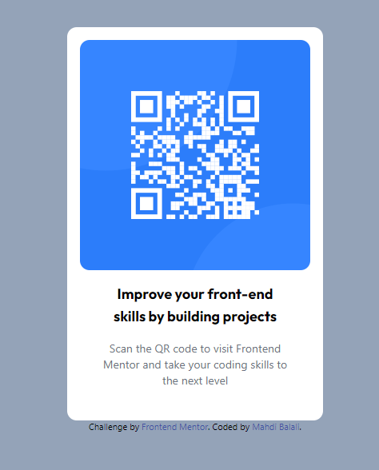

# Frontend Mentor - QR code component solution

This is a solution to the [QR code component challenge on Frontend Mentor](https://www.frontendmentor.io/challenges/qr-code-component-iux_sIO_H). Frontend Mentor challenges help you improve your coding skills by building realistic projects. 

## Table of contents

- [Overview](#overview)
  - [Screenshot](#screenshot)
  - [Links](#links)
- [My process](#my-process)
  - [Built with](#built-with)
  - [What I learned](#what-i-learned)
  - [Continued development](#continued-development)
  - [Useful resources](#useful-resources)
- [Author](#author)
- [Acknowledgments](#acknowledgments)

**Note: Delete this note and update the table of contents based on what sections you keep.**

## Overview

### Screenshot

This is my first challenge in Frontend Mentor website. I just come in this site, while starting to learn Tailwind CSS. So I did implement the challege using Tailwind CSS.
There is a great stuff in tailwind official website about installation and initialization of the framework, and also its classes.
I donot have access to the design files (FIGMA), so I tried to do my best by measuring the components and the actual pixels in the 
provided images. I used this [web site](https://www.rapidtables.com/web/tools/pixel-ruler.html), which is so simple, to measure dimensions in px.
Using the advantages of tailwind framework, my code is too small (less than 10 lines of HTML code.) and the css is just created by the framework.
I have used background color classes, padding, widhts, heights, borders, and flex classes to implement the current project.
Please feel free to inform me about my mistakes or the problems involved in this code.

### Links

- Solution URL: [Add solution URL here](https://your-solution-url.com)
- Live Site URL: [Add live site URL here](https://your-live-site-url.com)

## My process

### Built with

- Semantic HTML5 markup
- Tailwind CSS Framework
- Flexbox

### What I learned

While working on this project, I just searched around differnt classes of tailwindCSS framework and find out much more about them, especially the paddings, and dimensios, and flex. 

### Continued development

While working on this project, I just found out that I need to learn more about responsive design using tailwind, because it is providing great tools for that.
I have also lots of ambiguites about some of the common tailwind concepts and tools, such as containers, that I had to work on.

### Useful resources

- [Tailwind Official website 1](https://tailwindcss.com/) - I used this website to find the proper tailwind classes for my project.
- [This youtube crash course](https://www.youtube.com/watch?v=UBOj6rqRUME) - was so usefull for me, because it provides most important points in just half an hour. 

## Author

- Website - [Mahdi Balali](https://github.com/mbalali63)
- Frontend Mentor - [@mbalali63](https://www.frontendmentor.io/profile/mbalali63)
- Twitter - [@mahdibalali_frl](https://www.twitter.com/mahdibalali_frl)

## Acknowledgments

I want to express my gratitude to Frontend Mentor for providing an inspiring platform that has enhanced my skills as a web developer. Thanks to the challenges and the supportive community, I am empowering both creatively and technically. Special thanks to the Frontend Mentor team for curating valuable resources. Excited for more learning and collaboration in this fantastic community.

